# The object model of Self

Self was the first programing language that came with the concept of prototypes. Self fully gets by only with objects composed of slots, delegation between them and code assigned to objects. Of these ingredients, it manages to form a very powerful and flexible object model. This article is about the way how it does it. It has no ambitions to be an introduction to this interesting programing language; we will focus only on this small but important part that deserves the attention of everyone who wants to know more about object-oriented programing.

Today, the most used programing language based on prototypes is JavaScript. Unfortuantelly, it does not make a good name to this class of languages, so many people look through fingers at it. But Self proves that this approach is very versatile.

Objects in Self are composed of slots, which are named references. Self distinguishes several types of slots: data slots, argument slots, parent slots or slots referencing methods. Besides, it has several auxiliary kinds of slots. Some of them, paradoxically, do not need to have a name.

The delegation is a straightforward mechanism. When we send a message to an object, the virtual machine tries to find a slot in it with a name that corresponds to the message name. When this slot is a data slot, the result of this message is an object referenced by this slot. When the virtual machine does not find any fitting slot, it starts to search in objects that are referenced by parent slots of the given object. If the slot found contains a method, the code of this method is executed in the context of the object that received the message.

With the help of delegation, the shared behavior of objects is implemented, so it replaces classes that Self does not use. Let's have, for example, an object named `traits point` that provides behavior of all points. It is an analogue of a class with one difference. It does not specify any data items. Next to this object, let's have another object (we will name it `point prototype`) that is a pattern for points that we create. In our case, it contains data slots named `x` and `y` with default value `0`. This object contains a parent slot named `parent` which references the object with shared behavior (`traits point`). Names of parent slots end with a star character.

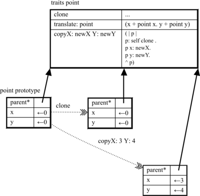

When we want to create a new point, we have two options: The most simple one is to take the prototype and clone it. The new object will contain new independent data slots with a copy of values in the prototype, but, at the same time, it will have the same behavior as the prototype.

The second option is to send to the prototype a message `copyX:Y:`. It knows it because the object with the shared behavior `traits prototype` contains a corresponding method. This method performs the cloning of the prototype and fills the data slots of the new object with values provided as the message arguments. It plays the role of a constructor.

The question is where the object of the shared behavior (the trait) finds the prototypes. Self solves this problem as follows. An object that wants to use the known traits and prototypes contains a parent slot referencing a special object named `lobby`. This object contains, besides other, a slot named `traits` with a collection of traits (e.g. `traits point`). It also contains a parent slot named `globals` that is referencing a collection of prototypes.

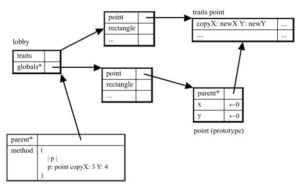

When an object needs to create a point, it sends the message `point` to itself. Because it does not understand it directly, it delegates it to `lobby` which does not understand it too, so it delegates it via the parent slots in `globals` to another object that understands it well, and returns the point prototype as the result. From this point object, we then make our own point with the demanded coordinates using the message `copyX:Y:`.

Every object creates its own namespace. Such structure is not forced and, in memory, you can have as many independent systems of objects as you wish. There is no real global object in Self.

Much more interesting is how Self manages methods. Method are, again, objects with slots. They have some associated code. For simplicity, we may presume that they contain only several trivial bytecode instructions: `pushSelf`, `send`, `resend`, `pop` and `returnTop` (we will disregard directed resend). It is important to be aware of the fact that the code of a method is always performed in context of the object that contains the code. Not in the context of the method that sends the message.

Let's have an example of an object that has two data slots named `x` and `a`. It also contains a slot named `mul:` referencing a method that multiplies its argument `arg` with the value of slot `a`. This method has an argument slot that is filled with a concrete value by the virtual machine in the moment of invocation of the method. Next, it includes a slot named `self` that is an argument slot and parent slot at the same time. This slot plays an important role during the method invocation.

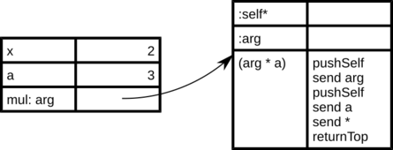

Let's say we send a message `mul: x` to our object to obtain the result of the multiplication of `x` and `a`. The virtual machine then tries to find a slot named `mul:` in this object and finds it. It is referencing a method. Because it is a method, the VM does not return the found object directly, but it performs several operations. First, it clones the method object and creates a new object called a method activation object.

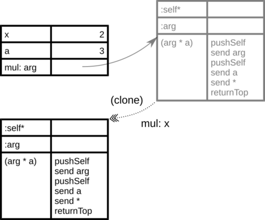

Then the VM inserts a reference to an object into the parent argument slot `self`, in the context of which the method should be performed. I recap: Do not forget that it will actually be performed in the context of the method with code - so in the method activation object.

Next, the virtual machine fills the argument slots. In our case, the slot `arg` in the method activation object will point to the same object as the slot `x`: the number two.

In the following step, the VM will start to execute the method's code. First, it pushes the method activation object on top of the stack (`pushSelf`). Then it sends the message `arg` to the object at the top of the stack. The object understands it because it has a slot of the same name (the argument slot). We remove the message receiver from the stack, and we insert the method call result, the number two. We push the method activation object again (`pushSelf`) and send a message `a` to it. Because it does not find the corresponding slot, it continues in delegation on the parent slots, `self` in our case. It will find it (in the object that received the message) and inserts the result, the number three, there (after removing the receiver from the stack). Then it sends the message for multiplication (`send *`) to the object of number three. It will leave the result on top of the stack that we use as an overall message send result.

In case we have an object that does not contain the method directly, but it delegates it via the parent slot, the process is the very same.

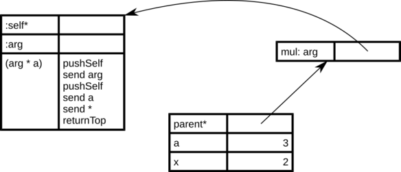

Here the VM obtains the method activation object first by cloning of the method object. The argument and parent slot `self` references the message receiver, so the method activation object has access to all its slots via delegation. Notice that `self` is a named slot so if the object sends `self` to itself, it is a standard message with the same processing mechanism as the other messages. It is not a pseudo-variable as in the case of Smalltalk.

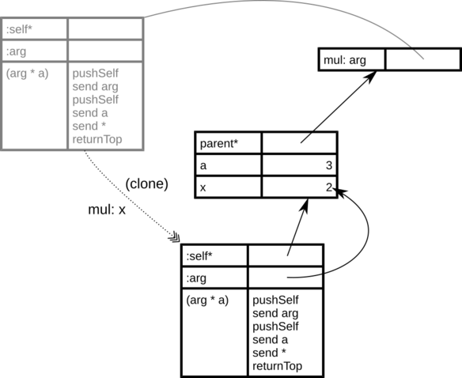

Blocks (that form closures) are slightly more complicated. Block is a syntactic shortcut for a literal composed of two objects: the block object and block method object. The block object references `trait block` via a parent slot. It is an object of shared behavior of all blocks. Next, it has an unnamed slot that references the lexical parent and slot that references the block method. The block method does not have the parent argument slot `self` but only an unnamed parent slot.

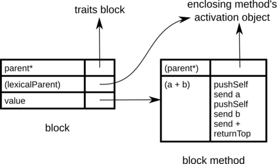

As an example, let's have an object that contains the method `doSomething` with one block `[x+y]`. In this method, we send a message `value` to this block.

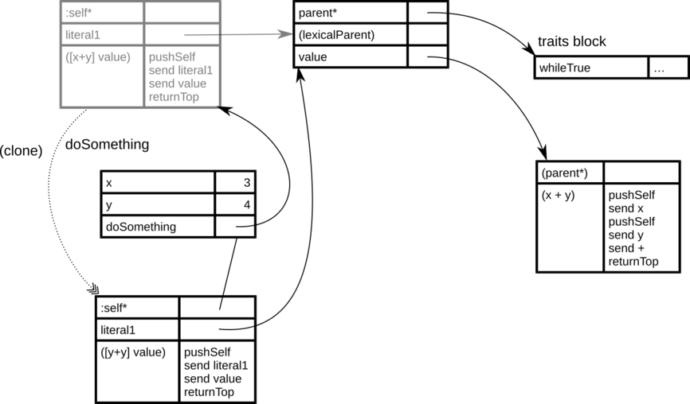

Let's send a message `doSomething` to this object. The method activation object is created in the standard way.

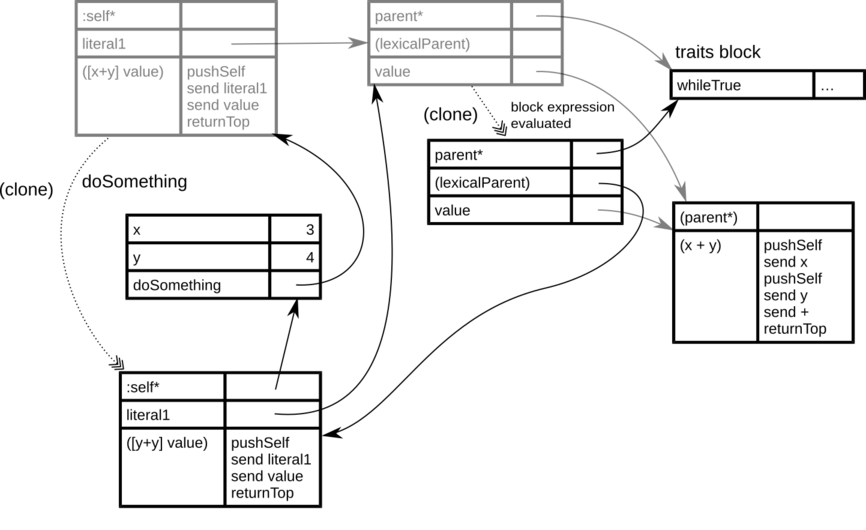

When the code with the block is evaluated (`send literal1`), the cloning of the block object is performed, and the virtual machine places a reference to the method activation object into a special slot of the lexical parent.

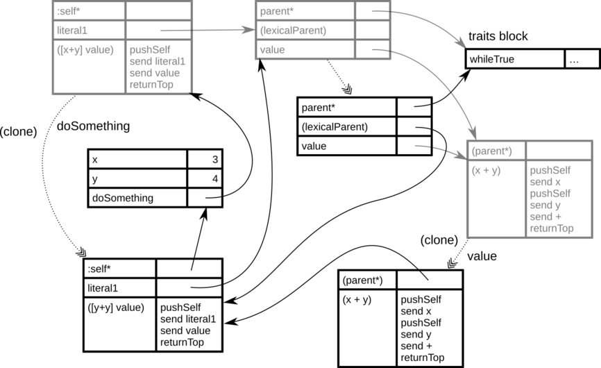

When we send the message `value` to this block, the cloning of the method block is performed (the block method activation object is created) and  its unnamed parent slot is filled with the reference that is the same as the reference in lexical parent slot of the block object.

When the code of the block is being executed - the code in the activation object of its method - it has, via the parent slot, access to all slots of the method (the block is performed in a context of this method).  So it can access the method arguments and local variables. Moreover, via the parent slot `self`, it can reach slots of the object in which context it is executed.

Noteworthy that message for block evaluation (`value` in this case) is not implemented by a method in the object of shared behavior (like in case of Smalltalk where the block class defines them), but it is a method that belongs directly to the block.

The nested blocks are even more tangled, but the principles are the same. Let's have a method with two nested blocks. Both of these blocks are literals in the context of the given method, and every one of them has its own standalone block method.

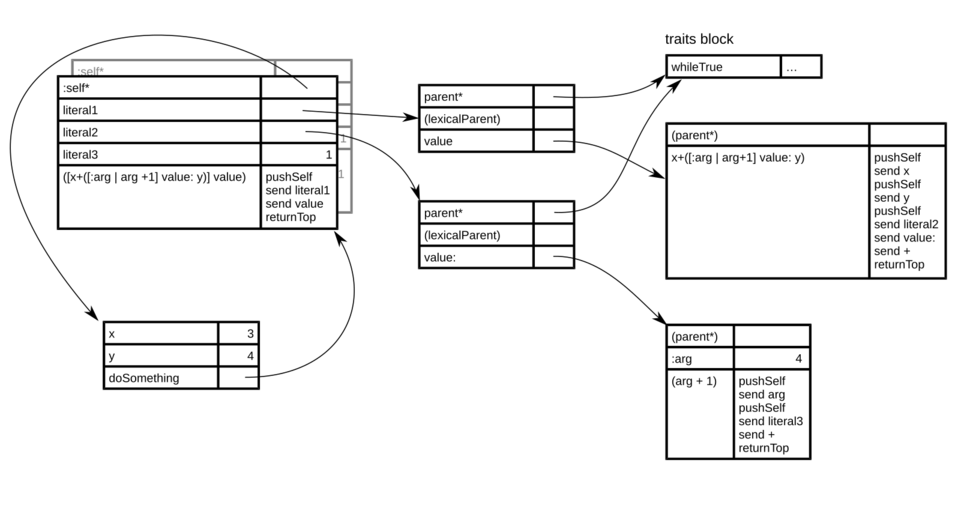

During the call of the message that is implemented by this method, the method activation object is copied in the standard way, and the parent argument slot `self` is filled.

During the evaluation of the code with the outer block, the object block is cloned, the lexical parent is set to the method activation object (of the whole method), and it is used as an unnamed parent of method activation object of the outer block.

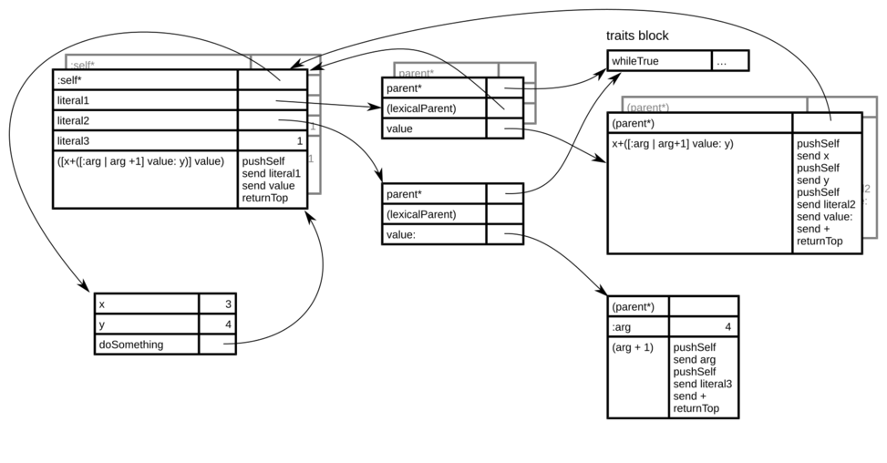

When the code with the inner block is evaluated, its lexical parent is set to the method activation object of the outer block. During block evaluation (`value:`), this reference is used even for the unnamed parent slot of the  method activation object of the inner block. During evaluation of the code in the context of this object, everything that the object needs is accessible via the delegation. Including its arguments and local variables, arguments and local variables of the outer block, arguments and local variables of the main method, and, last but not least, slots of an object in which the method is evaluated.

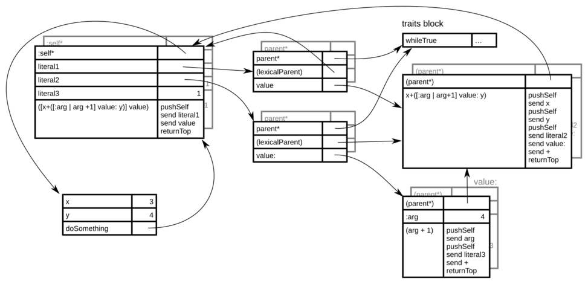

Self object model needs a minimum of basic concepts that are consistent even on the lowest level. Objects with slots with associated code and delegation between them. Still, it is able to reach non-trivial properties like multiple dynamic inheritance, first-rate namespaces. modules or full closures.

If you find this approach too academic and unusable in practice, you should know that Self does not work this way in reality and everything is highly optimized. At the same time, it does everything to hide it so the programmer gains advantages of a fast system with clean and elegant object design under the hood.
